# Paranoid Stash

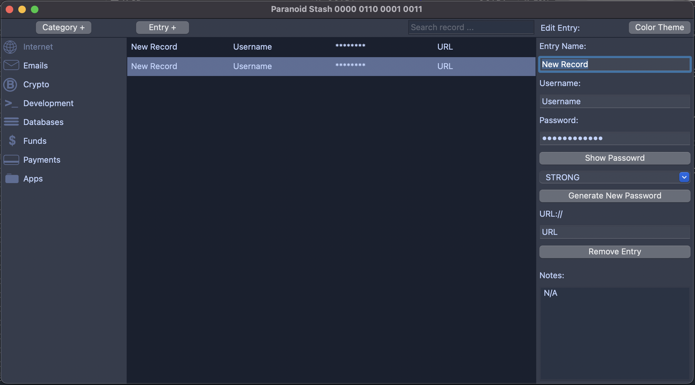

## Your Ultimate Local Encryption and Password Management Tool

Paranoid Stash is a powerful application designed for generating, storing, and managing passwords while providing top-notch encryption for your files. With Paranoid Stash, you can securely encrypt and decrypt files using AES256 encryption, ensuring your data remains private and protected.

#### Key Features:

#### Local-Only Security:

Paranoid Stash operates entirely on your local machine with NO
server connections or updates. Your data and passwords are never transmitted or
stored externally, guaranteeing complete privacy.

#### Robust Encryption:

Utilizing AES256 encryption, Paranoid Stash ensures that your files
are securely encrypted. It employs Salt for added protection and an Initialization Vector
to produce unique encrypted outputs for the same plaintext data.

#### Password Management:

Generate strong, secure passwords and store them safely within the app.
Your passwords are encrypted with the same level of security as your files.

#### Privacy First:

Paranoid Stash does not store any password information, including hashes.
The app is designed to be 100% safe as long as you remember your password.
Please note that if you forget your password, there is no way to recover it.

Paranoid Stash combines robust security features with a user-friendly interface, making it
your go-to solution for keeping your sensitive information safe and secure.

If you’re unsure why you need an offline password keeper for your online banking or crypto wallet, just check out these links for more info :)

# Last Securuty Breaches:

[Google Internal Database Leak 2024](https://www.medianama.com/2024/06/223-report-google-leak-privacy-security-errors/)

[Exposed 2FA Codes, Meta and Google 2023](https://www.mescomputing.com/news/4180998/unsecured-database-exposes-2fa-codes-google-meta)

[Security breaches in Top companies 2022-2024](https://tech.co/news/data-breaches-updated-list)

# Installation

#### 1.

Follow the link:
https://github.com/Deftr1dg3/paranoid_stash/blob/main/dist_x86_and_arm64/paranoid_stash_x86_and_arm64.tar.gz

#### 2.

Click the "Raw" button in the top right corner, and the file will be automatically downloaded to your "~/Downloads" folder.

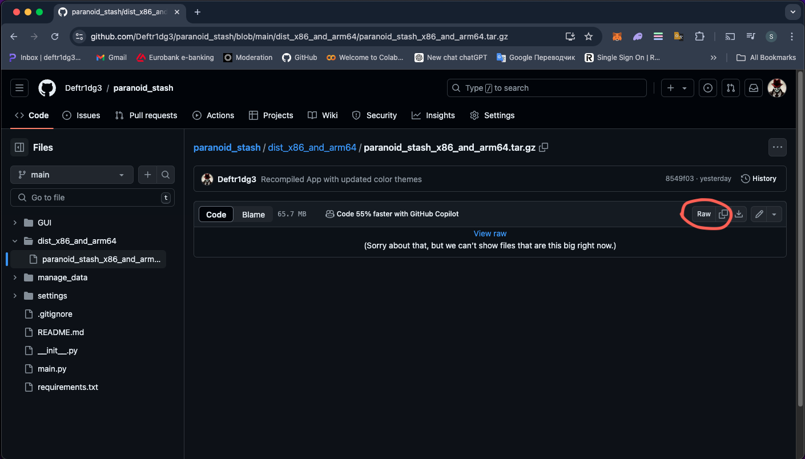

#### 3.

Open terminal and navigate to "~/Downloads"
and extract the app from archive:

    cd ~/Downloads
    tar -xzvf paranoid_stash_x86_and_arm64.tar.gz

The App "Paranoid Stash.app" will appear next to the archive in ~/Downloads
folder.

#### 4.

But it can NOT be opened, yet.
Because browser on Mac OS adds extended attributes to the
downloaded from internet files.

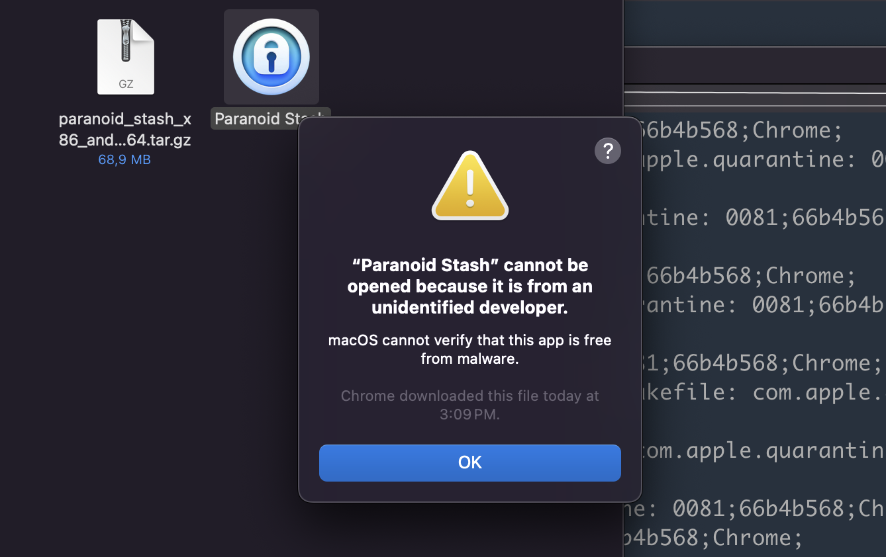

You can see them using:

    xattr -rl "Paranoid Stash.app"

Will look like this:
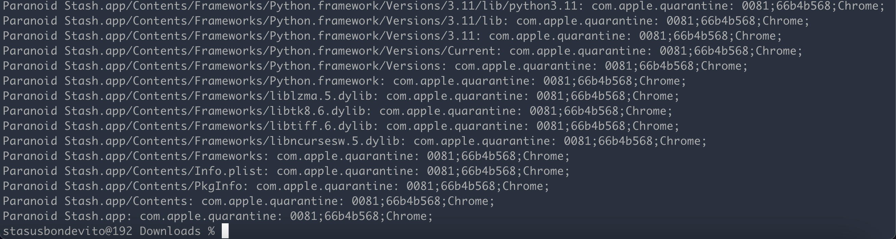

All these quarantine attributed added by system.

In order to launch the app we need to remove them first, using next command:

    xattr -rc "Paranoid Stash.app"

#### 5.

Move the app to the /Applications folder and double-click it. If you see a security warning about the app being downloaded from the internet:

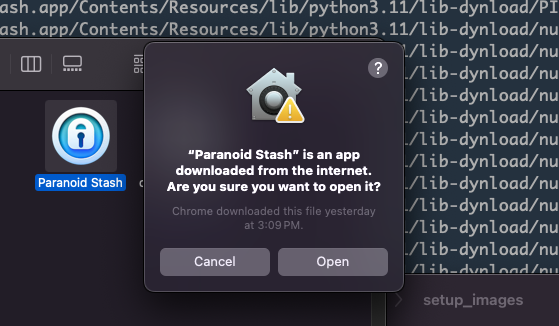

Click "Open" if it does not help, Go to:
Settings > Security & Privacy > "Open Anyway" to proceed.

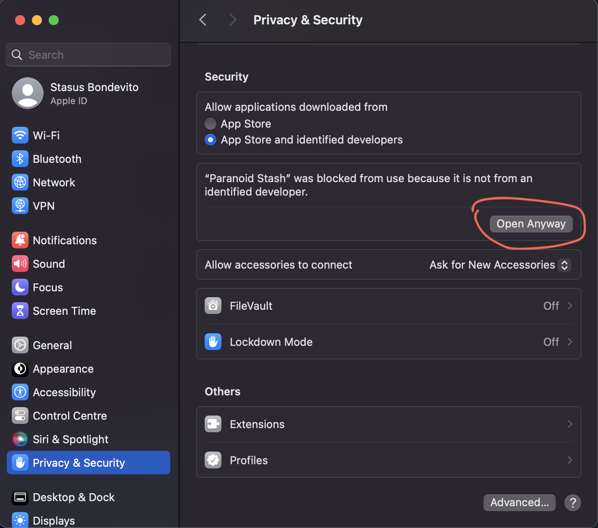

# First Launch

Once the app is opened, you will see the First Launch screen:

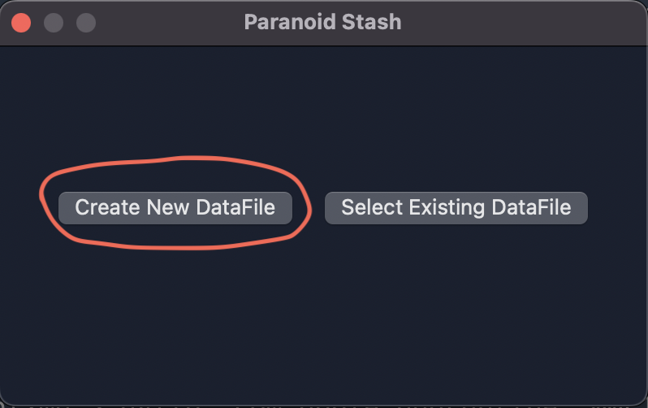

If this is your first time using the app, select "Create New Datafile." You’ll then be prompted to set a new password:

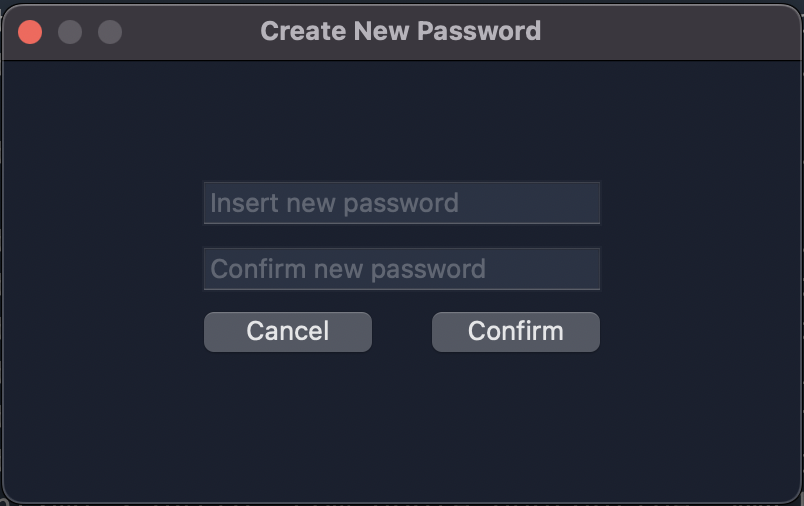

Then will appear the main app:

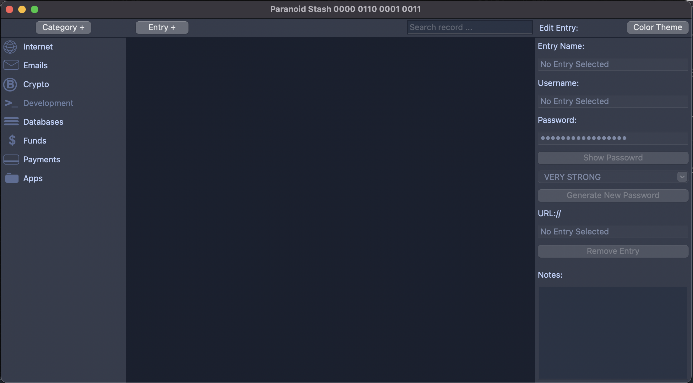

### That's all

### The interface is simple and intuitive.

"Category +" --> Create New Category

"Entry +" --> Create New Entry

"Color Theme" --> Change Color Theme

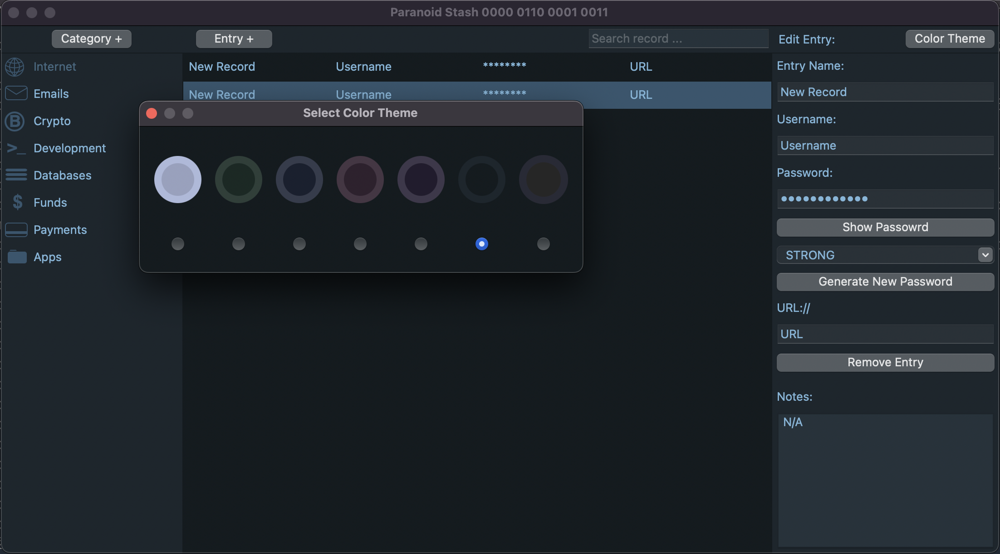

# File Encryption

In the app there is a built in module to encrypt and decrypt files.
It works very simple.

Choose "File Encryption" in the top bar menu:

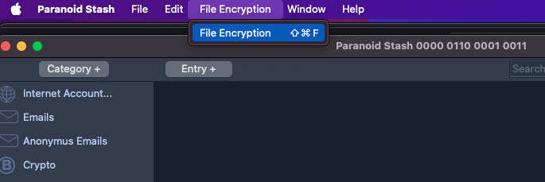

Will appear popup window:

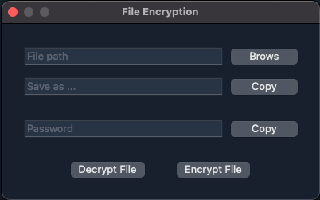

Next:

1. Brows File
2. Insert desired password and hit "Encrypt File"
3. "Save as ..." field just shows the encrypted file path,
   you can not change it. Only copy.

To decrypt a file, simply open the encrypted file with the ".enc" extension and enter the password used for encryption. The process is identical to encryption.

### If you want to encrypt a full directory, you need to archive it first to get one file:

    tar -czvf "{desired_name}.tar.gz" "target/dir/path"

### Then perform regular "File Encryption"

In the next version directory encryption may be added to the app as "Dir Encryption"

### Note that larger files will take longer to encrypt.

### 1.

In the next version of the app may be added an option to use photo.jpg
as DataFile

### 2.

In the next version of the app may be added an option hide encrypted file data
in photos
